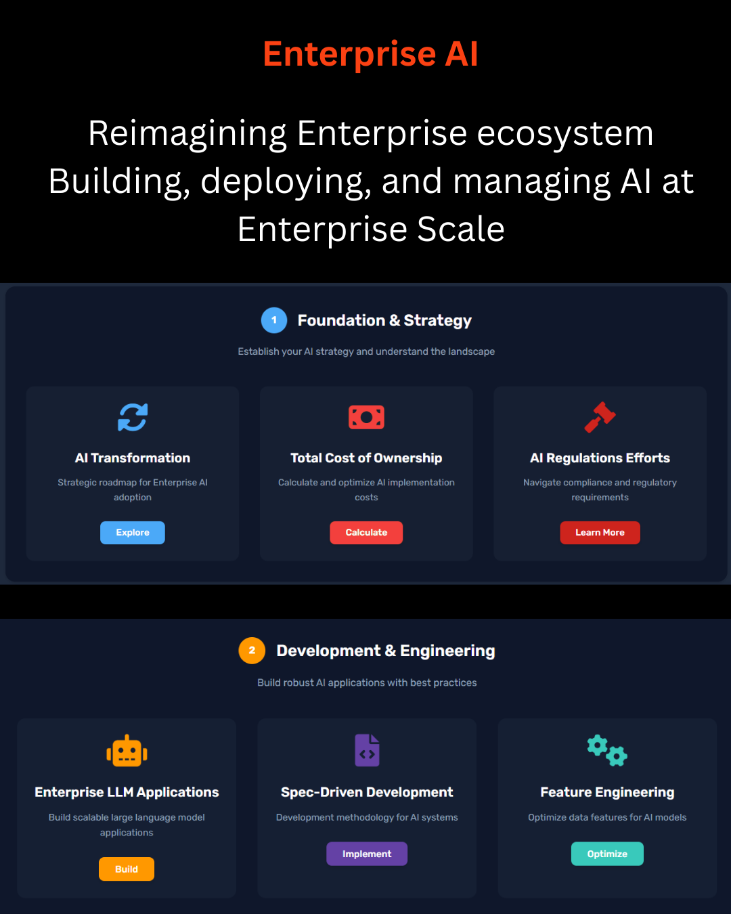
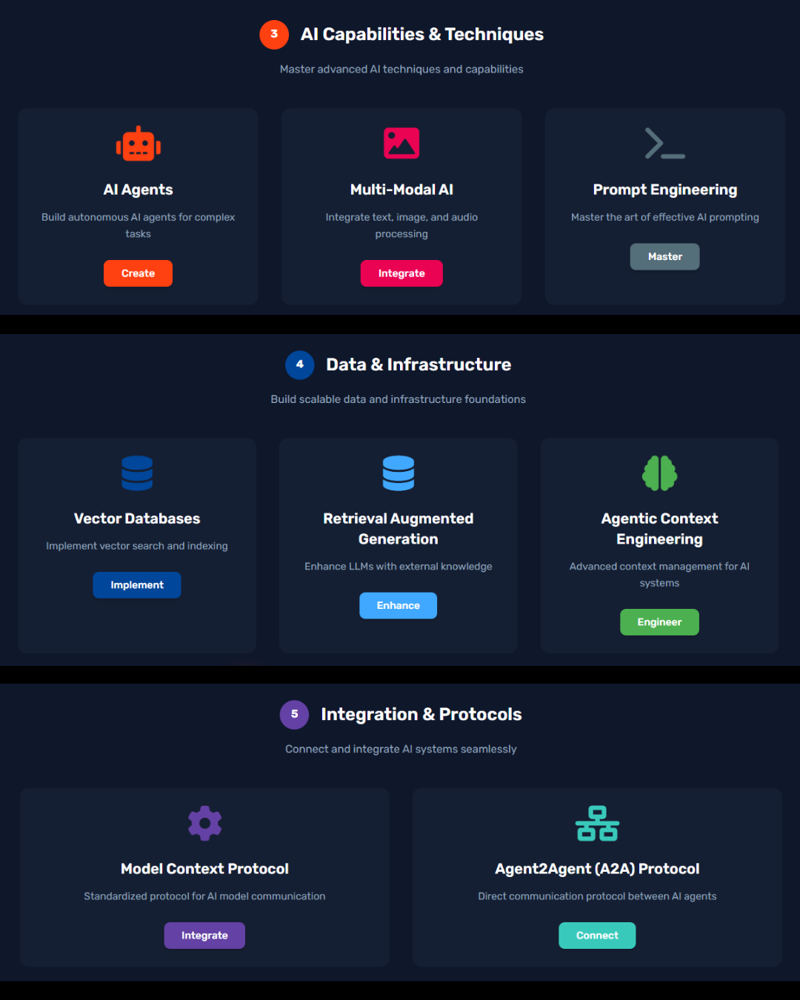
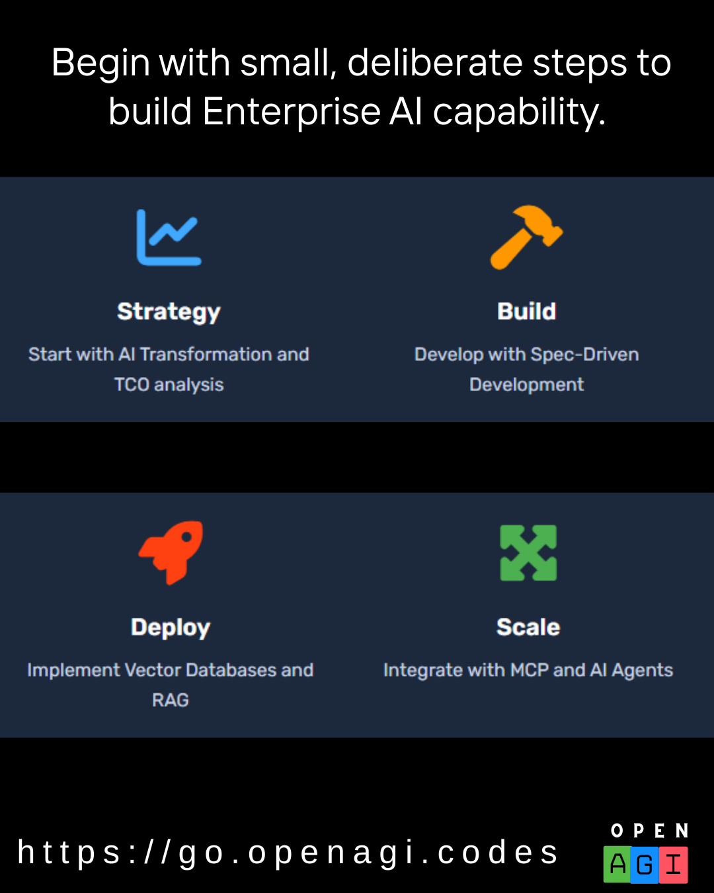

<!--
**amitpuri/amitpuri** is a ✨ _special_ ✨ repository because its `README.md` (this file) appears on your GitHub profile.

Here are some ideas to get you started:
-->

In 2026, may your creativity scale like parameters in a neural net, your insights converge like reasoning paths, and your actions embody the initiative of agentic intelligence.

I'm a tech enthusiast who is passionate about encouraging others to write clean and better code, though AI assisted to make difference. 

I am a seasoned technologist with over two decades of experience in driving digital transformation across multiple domains. 

My expertise spans cloud adoption, AI integration, and strategic technology consulting, where I’ve led large-scale projects and provided innovative solutions to global clients. 

I’m passionate about enabling teams to leverage emerging technologies and driving business growth through effective digital strategies.

------------------------------------------------------------------------------------------------------------------------------------
  
------------------------------------------------------------------------------------------------------------------------------------
  
------------------------------------------------------------------------------------------------------------------------------------
> Focus on improving yourself and not proving yourself.
------------------------------------------------------------------------------------------------------------------------------------
> Check out
- [AI News](https://go.openagi.news)
- [Cloud](https://go.opencloud.codes)
- [Citizen Developer codes](https://go.citizendeveloper.codes)
> Book (available on Kindle)
- [Citizen Development in Microsoft 365 with Power Platform](https://go.citizendeveloper.codes/buynow)
------------------------------------------------------------------------------------------------------------------------------------

------------------------------------------------------------------------------------------------------------------------------------
  
------------------------------------------------------------------------------------------------------------------------------------
  
------------------------------------------------------------------------------------------------------------------------------------  
  
------------------------------------------------------------------------------------------------------------------------------------

- I'm interested in 
,
,
,
,

- Cloud - 
,
,

- developing on/with
,
,

- else, hacking with
,
,

- or reading on
,

- and delivering the message via

-------------------------------------------------------------------------------------------------------

# 📊 GitHub Stats:

     

---
